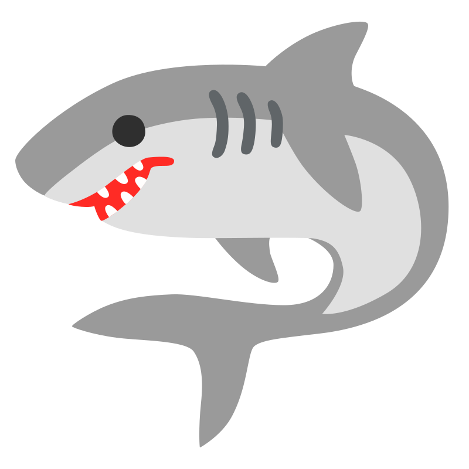
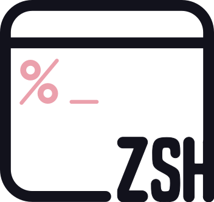
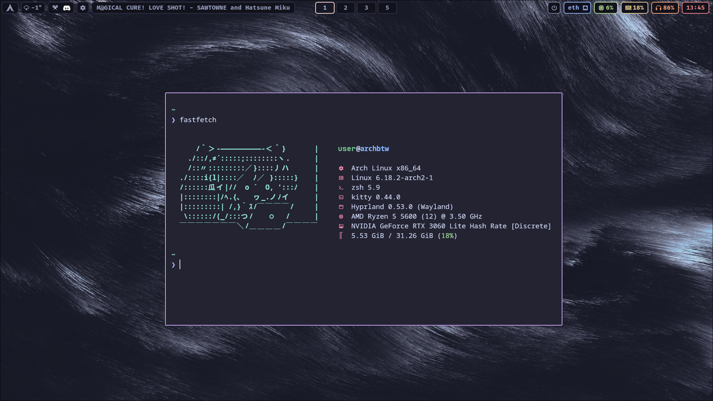

<h2 style="text-align: center;">Catppuccin (mocha)-themed Hyprland dotfiles! 😺</h2>
<div align="center">
    <table style="border: 3px solid #0A0A0AFF; width: 75%;">
        <tr>
            <td align="center" style="border: 2px solid #0A0A0AFF; padding: 5px">
                <br>
                <strong>WM:</strong> Hyprland
            </td>
            <td align="center" style="border: 3px solid #0A0A0AFF; padding: 5px">
                <br>
                <strong>Bar:</strong> Waybar
            </td>
            <td align="center" style="border: 3px solid #0a0a0a; padding: 5px">
                <br>
                <strong>Launcher:</strong> Wofi
            </td>
        </tr>
        <tr>
            <td align="center" style="border: 3px solid #0A0A0AFF; padding: 5px">
                <br>
                <strong>Notif daemon:</strong> Mako
            </td>
            <td align="center" style="border: 3px solid #0A0A0AFF; padding: 5px">
                <br>
                <strong>File manager:</strong> Nemo
            </td>
            <td align="center" style="border: 3px solid #0A0A0AFF; padding: 5px">
                <br>
                <strong>Editor:</strong> Micro
            </td>
        </tr>
        <tr>
            <td align="center" style="border: 3px solid #0A0A0AFF; padding: 5px">
                <br>
                <strong>Terminal:</strong> Kitty
            </td>
            <td align="center" style="border: 3px solid #0A0A0AFF; padding: 5px">
                <br>
                <strong>Shell:</strong> ZSH
            </td>
            <td align="center" style="border: 3px solid #0A0A0AFF; padding: 5px">
                <br>
                <strong>Prompt:</strong> Starship
            </td>
        </tr>
    </table>
</div>
<br>

<div style="display: flex; justify-content: center;">
	
</div>

### These dotfiles are customized to help with a dual monitor workflow on a desktop, so if you use a laptop or work on a single monitor, I highly recommend modifying the configs and/or forking the repo.
### If you already have a system up and running, skip some of the basic setup steps mentioned here (installing yay, etc). This guide assumes you have a fresh Arch or EndeavourOS install.

> [!NOTE]
> This project uses [chezmoi](https://www.chezmoi.io/) to simplify applying the dots.


### Install necessary packages:
```
sudo pacman -Syu
sudo pacman -S chezmoi copyq curl discord easyeffects fastfetch feh firefox git hyprland hyprlock hyprpicker hyprpolkitagent hyprshot hyprutils kdeconnect kvantum mako meson nemo nemo-fileroller noto-fonts nwg-look papirus-icon-theme pipewire pipewire-alsa pipewire-audio pipewire-pulse pipewire-session-manager pyenv python-cffi python-pip python-pipx qt5 seahorse starship swww ttf-firacode-mono-nerd ttf-jetbrains-mono-nerd waybar wget wireplumber wofi xdg-desktop-portal-gtk xdg-desktop-portal-hyprland zsh
```

### Install yay:
```
sudo pacman -S --needed base-devel
git clone https://aur.archlinux.org/yay-bin.git
cd yay-bin
makepkg -si
```

### Install virtual desktops plugin
```
hyprpm update
hyprpm add https://github.com/levnikmyskin/hyprland-virtual-desktops
hyprpm reload
```

### Install packages that are necessary for theming Qt and GTK applications catppuccin style (as well as a couple others from the AUR).
```
yay -S catppuccin-gtk-theme-mocha mirage pwvucontrol qqc2-desktop-style qqc2-desktop-style5 qt5ct-kde qt6ct-kde pwvucontrol waypaper wttrbar
```

### Theme Qt applications:
1. clone the Catppuccin KDE repository:
	```
   git clone https://github.com/catppuccin/kde
	```
2. Open Kvantum
3. Click "Select a Kvantum theme folder" and select the cloned directory
4. Click "Install this theme"
5. After the theme has been installed, open `qt5ct-kde` (which can be called "Qt5 Settings" or something similar)
6. In the "Appearance" tab, click the "Style" dropdown menu and select "kvantum"
7. Confirm with apply and OK
8. Repeat steps 5-7 with `qt6ct-kde`.
> [!IMPORTANT]
> A small amount of Qt apps won't apply the catppuccin style, such as KDEConnect and Filelight, from what I've seen. I've searched how to style all Qt apps consistently, yet there's no definitive guide for this from KDE devs or something. However, this seems to be the method that will style most of them correctly. If you know a more consistent way, feel free to open an issue.


### change the default shell to zsh
```
sudo chsh -s /bin/zsh
# reboot afterwards
```

### Install Oh My Zsh
```
sh -c "$(curl -fsSL https://raw.githubusercontent.com/ohmyzsh/ohmyzsh/master/tools/install.sh)"
```

### Theme Kitty
```
kitten themes
```
**Search for `catppuccin mocha` and select it**

### Fix "open in terminal" in Nemo
```
gsettings set org.gnome.desktop.default-applications.terminal exec kitty
gsettings set org.cinnamon.desktop.default-applications.terminal exec kitty
```

### Compile Hyprshutdown
```
git clone https://github.com/hyprwm/hyprshutdown
cd hyprshutdown
mkdir build
cd build
cmake ..
make -j$(nproc)
sudo make install
```

### Use chezmoi to apply the dotfiles:
```
git clone https://github.com/mintycrowbar/hyprland-catppuccin-dots
mkdir -p ~/.local/share
mv hyprland-catppuccin-dots ~/.local/share/chezmoi
chezmoi apply
```

> [!WARNING]
> Running `chezmoi apply` *will* override your config files with the dotfiles in the repo. Backup your old config if you want to keep it.

### Apply Bibata Cursor
```
cd hyprland-catppuccin-dots
tar -xvf Bibata-Original-Classic.tar.xz
mkdir -p ~/.local/share/icons
mv Bibata-* ~/.local/share/icons/
```
**Reboot afterwards, the environment variables in `~/.config/hypr/environment-variables.conf` should set the cursor automatically, if not, refer to the [Hyprland Wiki page](https://wiki.hypr.land/Hypr-Ecosystem/hyprcursor/)**

### post install steps
- `mkdir -p ~/Pictures/hyprshot` (this is where Hyprshot will store screenshots)
- edit `~/.config/hypr/environment-variables.conf` based on your GPU
- Write your location in `~/.wttrbar-location` so that the Waybar wttr.in module knows where to get its data from
- change your monitor setup in `~/.config/hypr/monitors.conf` (refer to `hyprctl monitors`)
- change `~/.config/hypr/my-programs.conf` to your liking
- optionally, clone the [catppuccin wallpapers repository](https://github.com/orangci/walls-catppuccin-mocha) to use with Waypaper

## Sources for some configuration files / utilities
- [Catppuccin](https://catppuccin.com/) (duh)
- [@typecraft](https://www.youtube.com/@typecraft_dev) on YouTube
- [emojicombos](https://emojicombos.com/) for the miku ascii
- [@orangci](https://github.com/orangci/walls-catppuccin-mocha) on GitHub for the catppuccin-colored wallpapers
- [Bibata Cursor](https://github.com/ful1e5/Bibata_Cursor/) on GitHub


<span style="text-decoration: underline">I'm not affiliated with Catppuccin in any way, this project is NOT from Catppuccin themselves, I just like their projects and wanted to make some cool dots, please don't sue me</span>